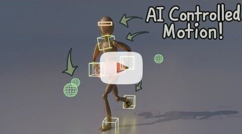
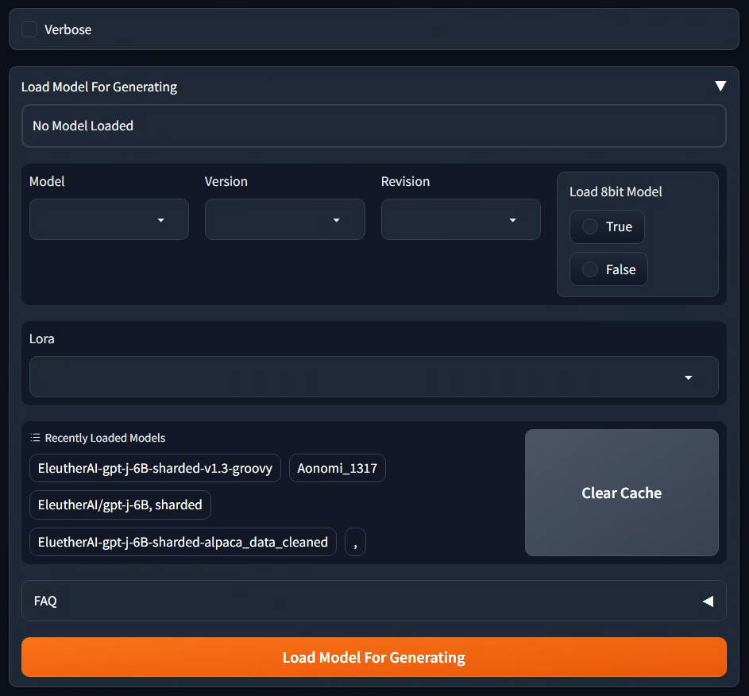

<h1 align="center">Tyler Chan</h1>

  -==
  <a href="http://tylerchan.me">
    </img>
    Website
  </a> -=-
  <a href="http://tylerchan.me/resume.pdf">
    </img>
    Resume
  </a> -=-
  <a href="https://www.linkedin.com/in/tyler-chan-b6b082186/">
    </img>
    LinkedIn
  </a> -=-
  <a href="mailto:tyler@tylerchan.me">
    </img>
    tyler@tylerchan.me
  </a> ==-

## Welcome! よこそう！ 欢迎光临！
👋 Hey! I'm Tyler, and I'm currently advancing my knowledge in machine learning and AI through the Accelerated Master's Program at Rensselaer Polytechnic Institute. My journey started as a Electrical Engineering major, but after taking my first Computer Science course, I was hooked. This led me to pursue a dual degree in Computer and Systems Engineering and Computer Science. Then, the cambrian explosion of generative models happened, and the potential of these models to create "creative" and "human-like" works led me to the field of machine learning and AI. 
- I'm currently a student at Rensselaer Polytechnic Institute (RPI)
- My current research interests are in Large Language Models, Latent Diffusion Models, Security and Privacy in ML.

## Education
- PhD in Computer Science @ RPI.
- Masters of Science in Computer Science @ RPI.
- Dual Bachelors of Science in Computer Systems Engineering and Computer Science @ RPI

## Currently working on:
* Doing a research project about machine unlearning with [Lei Yu](https://leiyucs.github.io/) as my advisor.
* Improving on [Utilizing IK for Generative Motion](https://github.com/generative-motion)!
* Working on [Text2Movie](https://debesttrap.github.io/Computational-Creativity/t2m.html)!
* Updating my previous Discord bots [Ferris](https://github.com/DeBestTrap/ferris-bot) and [Sekaidle](https://github.com/DeBestTrap/sekaidle) to utilize new Discord.py 2.0.0 features.
* Utilizing Stable Diffusion for a Discord Bot.
* Improving my personal website.

## Previous Projects and Work:
# [Utilizing IK for Generative Motion](https://github.com/generative-motion/motion-with-ik)
Adapted and enhanced an established generative motion project, originally based on the principles outlined in [Motion In-betweening via Two-stage Transformers](https://doi.org/10.1145/3550454.3555454) by Qin et al., by integrating IK controllers to optimize the efficency of the model.

  
  
See our preview video on youtube!

# [Text2Movie](https://debesttrap.github.io/Computational-Creativity/t2m.html)
Created a pipeline to transform a simple description into a
multi-scene movie complete with voice acting and videos, all
generated with SOTA tools.

  
  
Italian mobsters start an advertisement for a pizza company

Check out the site for more results and sound!

# [Alpaca-LoRA WebUI](https://github.com/DeBestTrap/alpaca-lora/tree/webui)
Created a WebUI with Gradio to more easily use, train
and evaluate/benchmark LoRAs for large language models
like GPT-2, LLaMA, GPT-J, etc.

  

# [OpenCircuits](https://github.com/OpenCircuits/OpenCircuits)

>OpenCircuits is an open source circuit designer created by [Leon Montealegre](https://leonmontealegre.com/), originally for an independent study for [Professor Paul Wilkinson](http://www.drpjw.org/) of Pasadena City College.

Opencircuits is also a Rensselaer Center for Open Source (RCOS) project.

  

Improved the busing feature by programming the ability
to select components instead individual ports to bus.

# [Automatic Pill Dispenser](https://github.com/DeBestTrap/pill-dispenser)
The Automatic Pill Dispenser (APD) is a project done for the Intro to Engineering Design course at Rensselaer Polytechnic Institute during the Spring of 2022.

  
  

Programmed an Arduino microcontroller in a semester
long design project for IED, the APD to control the dispensing of
pills and interfacing with a touch-screen display.

# [Sekaidle Bot](https://github.com/DeBestTrap/sekaidle)
Sekaidle is a game where the player gets a random country silhouette and must guess the country's name within six tries.

This is a creation of the country guessing game, [Wordle](https://worldle.teuteuf.fr/), that can be played in discord.

  

  
Implemented a dynamic programming algorithm to
find the most similar country names and suggest them
to the user to make up for the lack of an autocorrect
feature in discord.
    
# [Ferris Bot](https://github.com/DeBestTrap/ferris-bot)
Ferris is a simple bot whose purpose is to create and update polls live when users vote on a poll.

  

# [Scratch Pong](https://github.com/DeBestTrap/scratch-pong)
Recreated the classic game of pong on an Arduino Nano
with buttons and a tiny 128x32 OLED display on a
breadboard.

  

  
