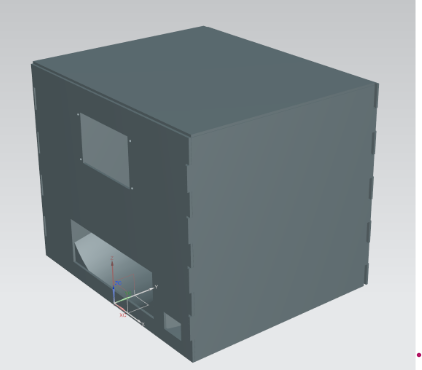
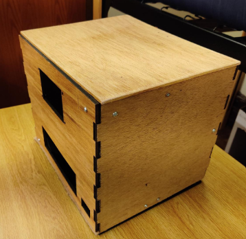

<h1 align="center">Tyler Chan</h1>

  -== <a href="http://tylerchan.me">Website (Redirects Here For Now)</a> -=-
  <a href="https://github.com/DeBestTrap/DeBestTrap/blob/main/resume_23-09-28.pdf">Resume</a> -=-
  <a href="https://www.linkedin.com/in/tyler-chan-b6b082186/">LinkedIn</a> -=-
  <a href="mailto:tyler@tylerchan.me">tyler@tylerchan.me</a> ==-

## Welcome! よこそう！ 欢迎光临！
I am currently a Senior persuing a Dual in Computer Systems Engineering and Computer Science at Rensselaer Polytechnic Institute (RPI). I am also doing a Co-Term for my masters at RPI in CS specializing in ML.

## Currently working on:
* Learning the web framework, Django to develop a website for my custom domain.
* [Overlord Bot](https://github.com/jwgit9/Overlord-Bot), a Discord bot developed by RPI students in RCOS.
* Updating my previous Discord bots [Ferris](https://github.com/DeBestTrap/ferris-bot) and [Sekaidle](https://github.com/DeBestTrap/sekaidle) to utilize new Discord.py 2.0.0 features.
* Utilizing Stable Diffusion for a Discord Bot.

## Previous Projects and Work:
# [Alpaca-LoRA WebUI](https://github.com/DeBestTrap/alpaca-lora/tree/webui)
Created a WebUI with Gradio to more easily use, train
and evaluate/benchmark LoRAs for large language models
like GPT-2, LLaMA, GPT-J, etc.

# [OpenCircuits](https://github.com/OpenCircuits/OpenCircuits)

>OpenCircuits is an open source circuit designer created by [Leon Montealegre](https://leonmontealegre.com/), originally for an independent study for [Professor Paul Wilkinson](http://www.drpjw.org/) of Pasadena City College.

Opencircuits is also a Rensselaer Center for Open Source (RCOS) project.

  

Improved the busing feature by programming the ability
to select components instead individual ports to bus.

# [Automatic Pill Dispenser](https://github.com/DeBestTrap/pill-dispenser)
The Automatic Pill Dispenser (APD) is a project done for the Intro to Engineering Design course at Rensselaer Polytechnic Institute during the Spring of 2022.

  
  

Programmed an Arduino microcontroller in a semester
long design project for IED, the APD to control the dispensing of
pills and interfacing with a touch-screen display.

# [Sekaidle Bot](https://github.com/DeBestTrap/sekaidle)
Sekaidle is a game where the player gets a random country silhouette and must guess the country's name within six tries.

This is a creation of the country guessing game, [Wordle](https://github.com/teuteuf/worldle), that can be played in discord.

  

  
Implemented a dynamic programming algorithm to
find the most similar country names and suggest them
to the user to make up for the lack of an autocorrect
feature in discord.
    
# [Ferris Bot](https://github.com/DeBestTrap/ferris-bot)
Ferris is a simple bot that'whose purpose is to create and update polls live when users vote on a poll.

  

# [Scratch Pong](https://github.com/DeBestTrap/scratch-pong)
Recreated the classic game of pong on an Arduino Nano
with buttons and a tiny 128x32 OLED display on a
breadboard.
